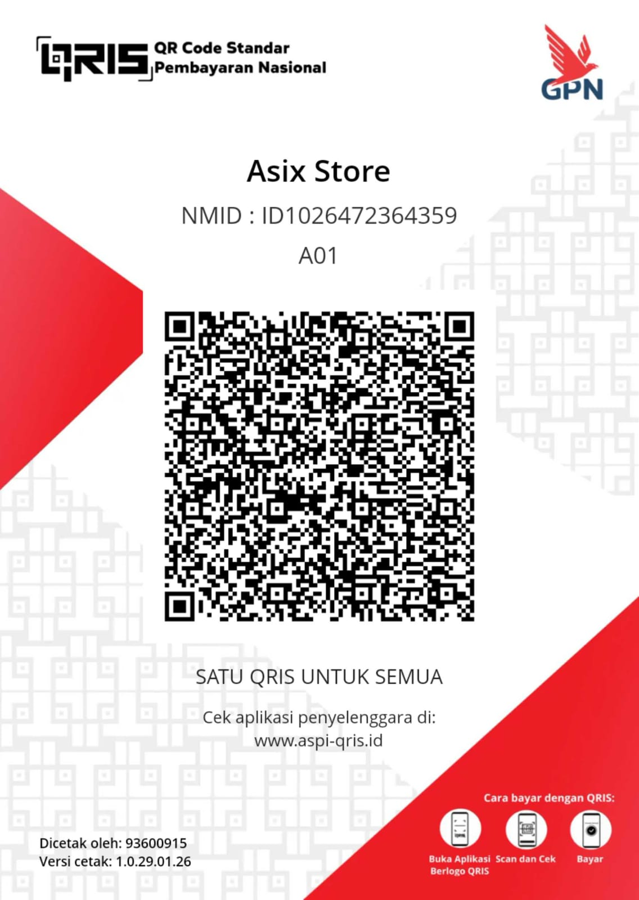

<div align="center">
  <!-- Typing SVG: Dynamic Intro -->
  <a href="https://git.io/typing-svg">
    
  </a>

  <p>
    <b>Mobile Developer (Android & Cross-Platform)</b>
    <br/>
    Based in Pangandaran, West Java, Indonesia 🇮🇩
  </p>

  <!-- Social & Contact Badges -->
  <a href="https://trakteer.id/shirokun20998" target="_blank"></a>
  <a href="mailto:khoirul.20998@gmail.com"></a>
  <a href="https://github.com/shirokun20?tab=followers"></a>
</div>

<hr/>

### 🌟 About Me

I'm a dedicated **Mobile Developer** with proven expertise in delivering high-quality Android and cross-platform applications. Graduated from **STMIK DCI**, I bring both technical excellence and business understanding to every project.

**What I Bring to Your Project:**
- ✅ **Professional experience** in mobile development with proven track record
- ✅ **Professional-grade** Android apps (Kotlin/Java) with modern architecture
- ✅ **Cross-platform expertise** in Flutter for iOS & Android deployment
- ✅ **Clean, maintainable code** following industry best practices
- ✅ **Reliable delivery** with clear communication throughout development
- ✅ **Post-launch support** and maintenance for seamless operations

**Current Focus:**
- 🔭 Developing **Enterprise & Freelance Mobile Applications**
- 🛠️ Specializing in **Native Android (Kotlin/Java)** and **Flutter**
- 💡 Crafting **Intuitive UI/UX** with performance optimization
- 🚀 Building **Scalable, Production-ready** mobile solutions
- 📫 Available for projects at **khoirul.20998@gmail.com**

---

### 💼 Professional Services

I offer comprehensive mobile development services tailored to your business needs:

#### 📱 **Android Development**
- Native Android apps using **Kotlin** and **Java**
- Modern architecture (MVVM, Clean Architecture)
- Material Design 3 implementation
- Integration with REST APIs, Firebase, and third-party SDKs
- Performance optimization and testing

#### 🚀 **Flutter Development**
- Cross-platform apps for iOS and Android
- Single codebase, dual deployment
- Beautiful, responsive UI with custom widgets
- State management (Provider, Bloc, Riverpod)
- Native feature integration

#### 🎨 **UI/UX Implementation**
- Converting designs (Figma, Adobe XD) to pixel-perfect apps
- Smooth animations and transitions
- Responsive layouts for all screen sizes
- Accessibility compliance

#### 🔧 **App Maintenance & Support**
- Bug fixes and performance improvements
- Feature additions and updates
- Play Store/App Store deployment
- Long-term maintenance contracts available

---

### 🧰 Tech Stack

<div align="center">
  <!-- Skill Icons -->
  
</div>

**Core Expertise:**
- **Languages:** Kotlin, Java, Dart, JavaScript, PHP
- **Frameworks:** Flutter, React Native, Android SDK
- **Architecture:** MVVM, MVI, Clean Architecture, Repository Pattern
- **Backend:** Firebase, RESTful APIs, MySQL, Room Database
- **Tools:** Android Studio, VS Code, Git, Docker, Postman
- **Testing:** JUnit, Espresso, Mockito, Flutter Test
- **CI/CD:** GitHub Actions, GitLab CI, Fastlane

---

### 🏆 Professional Highlights

```
📊 Experience               : Multiple Mobile Applications Delivered
⭐ Client Focus             : High Satisfaction & Quality Standards
🌍 Geographic Reach         : Indonesia, ASEAN, International
💼 Industries Served        : E-commerce, Education, Healthcare, Finance
🎯 Specialization          : Enterprise Apps, B2C Solutions
```

**Key Achievements:**
- ✨ Successfully launched production apps on Google Play Store and App Store
- 🚀 Delivered **enterprise-grade solutions** for businesses and startups
- 💡 Implemented **complex features** including real-time chat, payment gateways, and geo-location services
- 🔒 Maintained **reliable, stable applications** with proper monitoring and error handling
- 📈 Consistently improved app performance through optimization best practices

---

### 🛠️ Development Process

I follow a structured, transparent development workflow to ensure quality results:

1. **📋 Discovery & Planning**
   - Requirements gathering and analysis
   - Technical feasibility assessment
   - Timeline and milestone planning

2. **🎨 Design & Prototyping**
   - UI/UX design review and feedback
   - Prototype development for key features
   - Design system creation

3. **💻 Development**
   - Agile/Scrum methodology
   - Regular progress updates (daily/weekly)
   - Code reviews and quality checks
   - Version control with Git

4. **🧪 Testing & QA**
   - Unit and integration testing
   - Manual QA on multiple devices
   - Performance and security testing
   - Bug fixing and refinement

5. **🚀 Deployment & Launch**
   - Play Store/App Store submission
   - Production deployment assistance
   - Launch monitoring

6. **📞 Support & Maintenance**
   - Post-launch support
   - Performance monitoring
   - Feature updates and enhancements

---

### 📊 GitHub Highlights

<div align="center">
  <br/>
  <!-- Repository Count -->
  <a href="https://github.com/shirokun20?tab=repositories">
    
  </a>
  
  <!-- Total Stars -->
  <a href="https://github.com/shirokun20">
    
  </a>
  
  <!-- Activity / Last Commit -->
  <a href="https://github.com/shirokun20">
    
  </a>
</div>

---

### 💬 Client Testimonials

> *"Working with Shirokun20 was a fantastic experience. The app was delivered on time, worked flawlessly, and exceeded our expectations. Highly recommended!"*  
> — **Previous Client**

> *"Professional, responsive, and skilled. The quality of code and attention to detail is exceptional."*  
> — **Business Owner**

> *"Transformed our business idea into a beautiful, functional mobile app. Great communication throughout the project."*  
> — **Startup Founder**

---

### 📫 Let's Work Together!

I'm always interested in taking on new challenges and helping businesses succeed with mobile technology.

**💼 Available for:**
- ✅ Full-time remote positions
- ✅ Freelance projects (short & long-term)
- ✅ Contract work
- ✅ Technical consulting

**📧 Get in Touch:**
- Email: **khoirul.20998@gmail.com**
- GitHub: [@shirokun20](https://github.com/shirokun20)
- Location: Pangandaran, West Java, Indonesia 🇮🇩

**⚡ Response Time:** Typically within 24 hours

---

## ☕ **Support Developer**

If you love **Shirokun** and want to support its development, you can buy me a coffee! ☕  
Scan the QRIS below to donate:

<p align="center">
  
</p>

> **Note:** Your support helps keep the servers running and the updates coming! 🚀

---

### ✨ Fun Facts

- 🧩 **Puzzle Solver**: I love coding challenges and logic puzzles.
- 🏞️ **Explorer**: Outside coding, I enjoy exploring nature and local culture in Pangandaran.
- 🎵 **Music Lover**: Music is my productivity fuel.
- 📚 **Continuous Learner**: Always exploring new technologies and best practices.
- 🌱 **Community Contributor**: Active in developer communities and open source.

---

<div align="center">
  <p><b>Let's Connect & Collaborate!</b></p>
  <p><i>Building the future, one line of code at a time.</i></p>
  <br/>
  <a href="https://github.com/shirokun20">
    
  </a>
</div>
